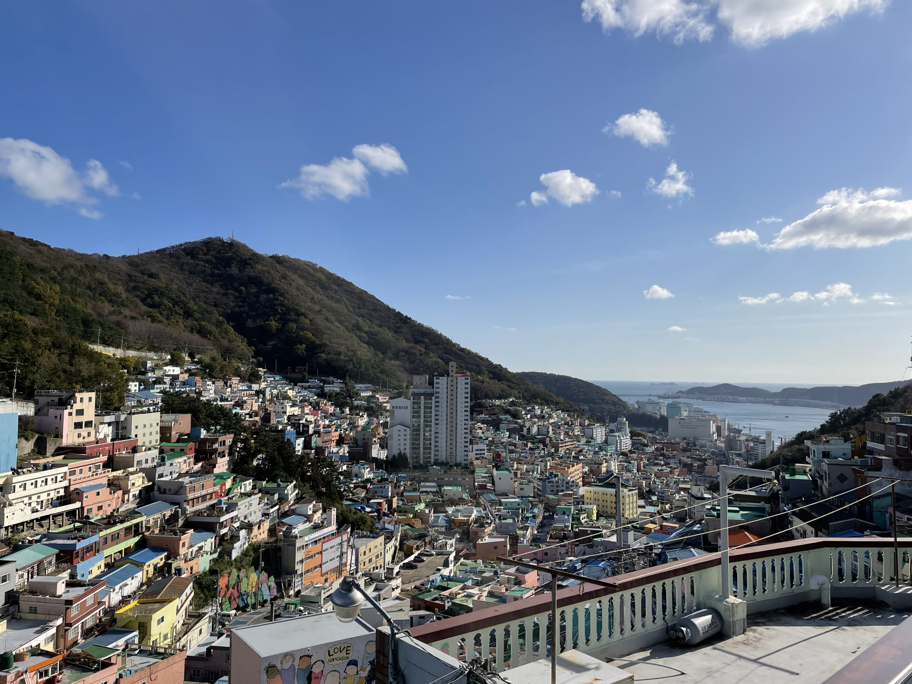

# Write-up : Please draw me a sheep (OSINT)

## Informations générales
- **Titre** : Please draw me a sheep
- **Type** : OSINT
- **Description** : One of our friends went on a journey, and sent us this beautiful picture. Can you find the location of this image ? ⚠️ Heads up! This challenge has a maximum of 20 attempts. Think before you submit! 🧠 Flag Format: CCOI26{village_city_country}

## Image du challenge

## Analyse du problème
L'image fournie montre :
- Un village densément construit avec des maisons colorées (toits et façades multicolores : bleu, rose, vert, jaune, etc.).
- Des bâtiments empilés sur une colline escarpée, avec une végétation boisée en arrière-plan.
- Une vue sur une baie ou un port en contrebas, avec des immeubles plus modernes et la mer au loin.
- Un ciel clair avec quelques nuages, suggérant un climat tempéré.
- Au premier plan, un balcon ou une terrasse avec une rambarde et un mur peint (avec des dessins comme "LOVE" et des personnages).

Cela évoque un lieu touristique connu pour son architecture pittoresque, potentiellement en Asie (style urbain dense). Pas de texte visible sur l'image pour une recherche directe, donc une recherche par image inversée semble idéale.

## Résolution
Voici les étapes pour résoudre ce challenge de manière claire et reproductible :

1. **Recherche par image inversée** :
   - Utilisez Google Images (ou un outil similaire comme Yandex ou TinEye) pour effectuer une recherche inversée.
   - Téléchargez l'image fournie et uploadez-la sur Google Images (via l'icône de l'appareil photo dans la barre de recherche).
   - Google identifiera des images similaires ou identiques.

2. **Analyse des résultats** :
   - Parmi les résultats, on tombe rapidement sur des pages décrivant "Gamcheon Culture Village" à Busan, en Corée du Sud.
   - Un lien pertinent : https://fundforeducationabroad.org/journal/touring-south-korea-adventures-in-busan-part-2/ (un blog de voyage qui inclut une photo similaire et décrit le lieu comme "Gamcheon Culture Village" à Busan).
   - D'autres résultats confirment : Wikipédia, sites touristiques (comme Visit Korea), ou blogs de voyage mentionnent ce village comme un ancien quartier de réfugiés transformé en attraction artistique, connu pour ses maisons colorées et ses vues sur le port de Busan.

3. **Vérification et reconstitution du flag** :
   - Village : Gamcheon (ou plus précisément Gamcheon Culture Village, mais le format simplifié est "gamcheon").
   - Ville : Busan.
   - Pays : Korea (ou South Korea, mais le flag utilise "korea" – attention aux variantes !).
   - Testez des formats comme CCOI26{gamcheon_busan_korea}, en minuscules et avec underscores, car le challenge limite les essais à 20.
   - Évitez les erreurs courantes : "Gamcheon_Busan_SouthKorea" (majuscules, "SouthKorea" au lieu de "korea").
   - Confirmation : Le flag valide est CCOI26{gamcheon_busan_korea}.

Astuce : Si la recherche Google ne donne pas immédiatement, essayez d'ajouter des mots-clés comme "colorful village hill sea" pour affiner. Vérifiez aussi sur des cartes (Google Maps) en cherchant "Gamcheon Culture Village" pour confirmer la vue aérienne.

## Flag
CCOI26{gamcheon_busan_korea}

